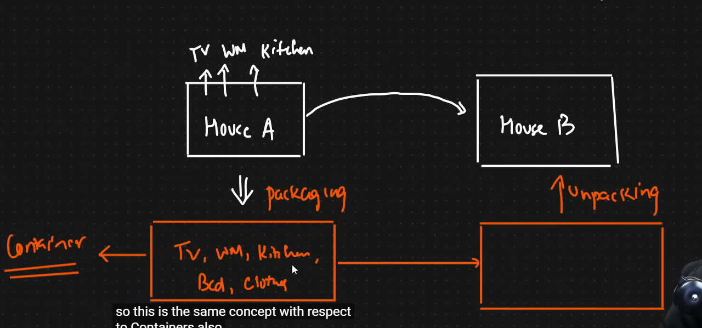
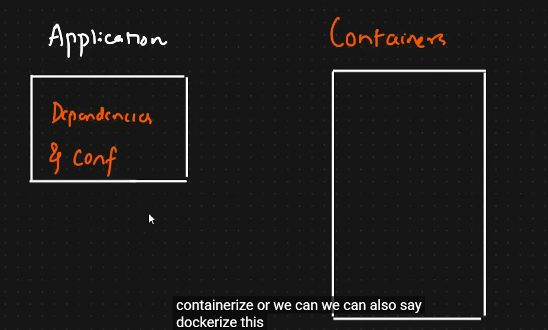
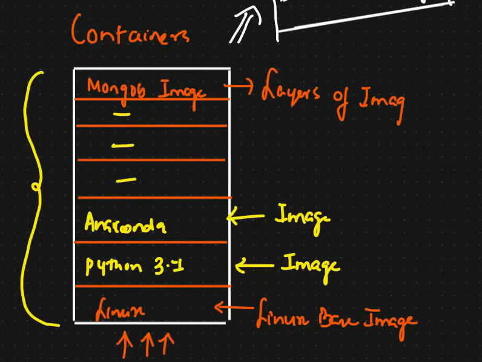
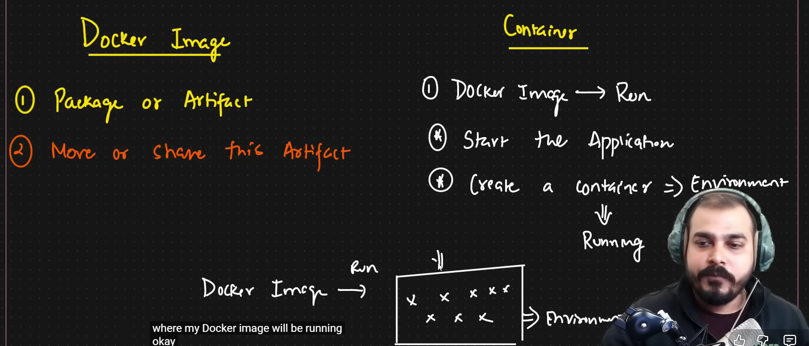
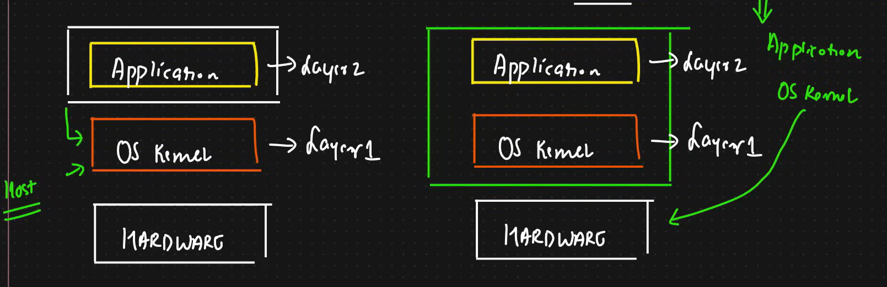
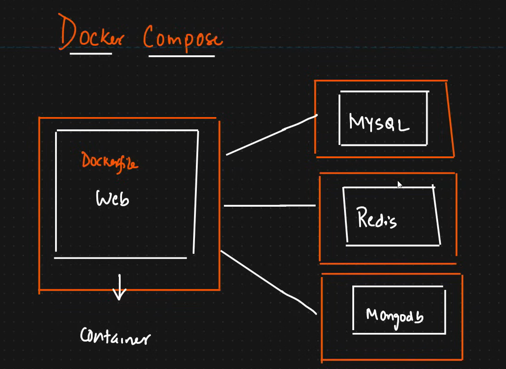

### Docker For DS:
### Containers:
#### Before containers, in order to set uo the development environment,the PErson who is working on the project needs to install all the Dependencies every time. 
#### These leads to error , as some of the dependencies may be missed. This posed a huge problem in Quality Assurance (QA) server phase.
#### **Containers Definition:** A way to package all the dependencies and the configuration necessary to set up and run the application.
#### - its a  portable artifact, i.e we can easily share and move the package   to **ANY ENVIRONMENT**
#### - Real life example of CONTAINERS:

### Docket Images and Containers:

#### In order to Convert the application into  a container, we need to COntainerize or dpckerize it
#### IN terms of Containers, we will create layers of Images, the base Image will be one  Linux BAse image
#### **CONTAINERS is a combination of Layers of Images**

#### - Consider the above image. The layers of Images together constiutes a DOCKER IMAGE
#### - When the Docker Image is Run, it creates a container which is an environment,then all the necessary dependencies are installed which leads to setting up of the application.
### Note: Docker IMages are very small

### Difference between Docker IMage and Container:
 

### What is Difference betweeen Containers and Virtual Machines?

### - Docker Virtualizes only the Application layer of the OS, whereas VM virtualizes both application as well as Kernel LAyer of OS.
### - This is the Reason why Docker images are small and VM sizes are big(As virtualizes bothj applkication and kernel layer)
### - Dockers Run start and Run much faster than VM
### COMAPATABILITY: **VM** can be installed in any OS, but there maybe Installation issue for some OS(Compatabilityb issue), example: for windows version less than 10, we cant install Linux Images for windows 10 >= the OS KErnel is able to communicate with linux images (the OS kernel supports)

### Docker Commands:
### docker ps => to see how many containers are running
### docker images => to see how many images are there
### docker build -t image name . -=> to create a docker image
### docker run -p host port:docker port dockerimagename => docker run -p 5000:5000 initialdemo
### docker stop container id => to stop the running container
### docker push container name => to push the docker container into docker hub

## DOCKER COMPOSE:

### - Docker Compose is a tool to DEFINE and RUN multi-container Docker Applications
### - In teh above example we have the web application container, MUSql container, Redis Container, MongoDB conmtainer
### - we will create Docker-compose.yml file and write all the configuration in this file