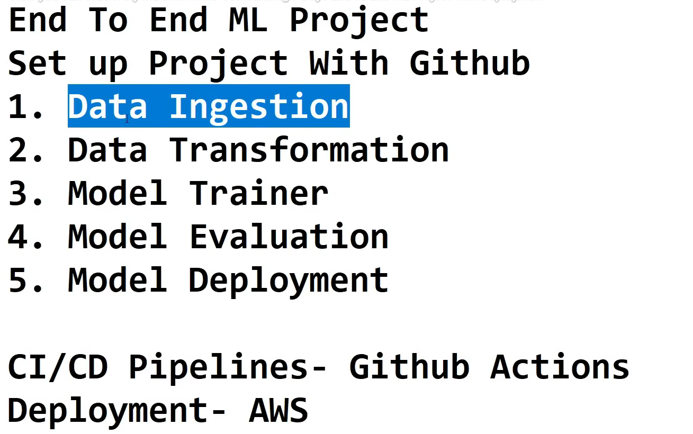
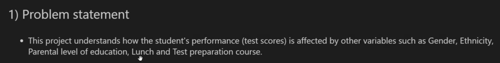
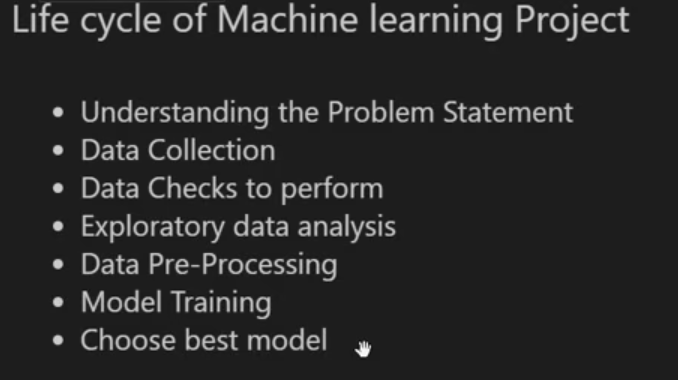

# Project 1:
  

# DAY-2
## Problem Statement: Student Performance Indicator
#### Dataset: 

#### Why choose this project:
#### We will be finding Features of Every type, i.e Categorical features, Numerical Features, NaN values, multiple things
#### We will get to know how we can solve the Feature Engineering
#### Till now we have created models in Jupyter Notebook, Now we are going tp write those as modular code
### Will get to learn about EDA
